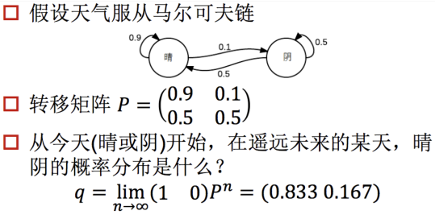
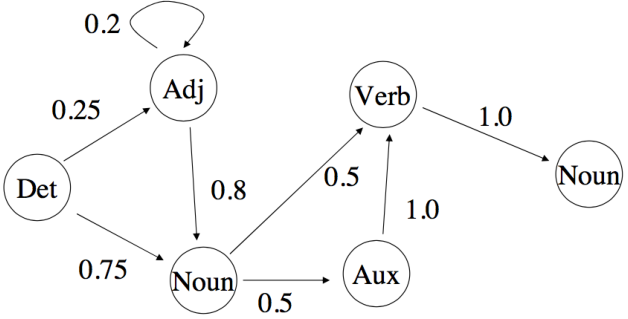
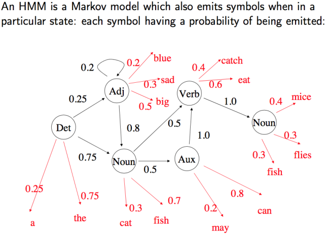
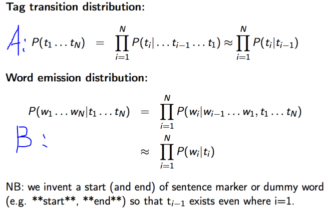

[toc]

# HMM(Hidden Markov Model)

## 阅读提示

先看QA，作为预备知识，然后可以看[隐马尔科夫模型](https://zhuanlan.zhihu.com/p/27907806)，里面讲了什么是“隐变量”与“条件独立性”。

## QA

### 1. 什么是马尔科夫性，什么是马尔科夫随机场（Markov Random Field），其数学描述是怎样的？（完全参考自[百度百科](https://baike.baidu.com/item/马尔可夫随机场)）

#### 什么是马尔科夫性？

1. 人们在实际中常遇到具有下述特性的随机过程：在已知它目前的状态(现在)的条件下，它未来的演变（将来）不依赖于它以往的演变（过去）。这种已知“现在”的条件下，“将来”与“过去”独立的特性称为**马尔可夫性**，具有这种性质的随机过程叫做**马尔可夫（随机）过程**。

   **其数学描述为**：图的顶点u在状态的概率只依赖顶点u的最近临节点，并且顶点u对图中的其他任何节点是条件独立的。

   马尔科夫随机过程是一类随机过程。它的原始模型[马尔可夫链](https://baike.baidu.com/item/马尔可夫链)，由俄国数学家A.A.马尔可夫于1907年提出。

   注：知乎上的https://zhuanlan.zhihu.com/p/33397147和上面说的有点不一样，知乎上写的如下：

   ```
   2.1.3 马尔科夫假设&马尔科夫性
   
   这个也属于前馈知识。
   
   **1. 马尔科夫假设**
   
   额应该是齐次马尔科夫假设，这样假设：马尔科夫链 ![[公式]](https://www.zhihu.com/equation?tex=%EF%BC%88x_%7B1%7D%2C%5Ccdots%2Cx_%7Bn%7D%29) 里的 ![[公式]](https://www.zhihu.com/equation?tex=+x_%7Bi%7D) 总是只受 ![[公式]](https://www.zhihu.com/equation?tex=+x_%7Bi-1%7D)一个人的影响。
   马尔科夫假设这里相当于就是个1-gram。
   
   马尔科夫过程呢？即，在一个过程中，每个状态的转移只依赖于前n个状态，并且只是个n阶的模型。最简单的马尔科夫过程是一阶的，即只依赖于器哪一个状态。
   
   **2. 马尔科夫性**
   
   马尔科夫性是是保证或者判断概率图是否为概率无向图的条件。
   
   三点内容：a. 成对，b. 局部，c. 全局。
   ```

#### 什么是马尔科夫随机场？

1. 马尔可夫随机场（Markov Random Field）包含两层意思。

   * **马尔可夫性质**：见上

   * **随机场**：当给每一个位置中按照某种分布随机赋予相空间的一个值之后，其全体就叫做随机场。我们不妨拿种地来打个比方。其中有两个概念：**位置（site），相空间（phase space）**。“位置”好比是一亩亩农田；“相空间”好比是种的各种庄稼。我们可以给不同的地种上不同的庄稼，这就好比给随机场的每个“位置”，赋予相空间里不同的值。所以，俗气点说，随机场就是在哪块地里种什么庄稼的事情。

   **马尔可夫随机场（又叫马尔可夫网）**：马尔科夫随机场是具有马尔科夫特性的随机拿种地打比方，如果任何一块地里种的庄稼的种类仅仅与它邻近的地里种的庄稼的种类有关，与其它地方的庄稼的种类无关，那么这些地里种的庄稼的集合，就是一个马尔可夫随机场。

#### 相关数学描述

1. 数学描述

   * 把马尔科夫随机场映射到[无向图](https://baike.baidu.com/item/无向图)中，此无向图中的**节点都与某个随机变量**相关，连接着节点的**边**代表与这两个节点有关的**随机变量之间的关系**，所以，马尔科夫随机场其实表达出随机变量之间有些关系因素是**必须要考虑**的，而另外则有些是可以**不用考虑**的。

   * 马尔可夫随机场，也叫马尔可夫网。**无向图模型**也叫**马尔科夫随机场**(MarkovRandomFields)或**马尔科夫网络**(MarkovNetwork)，无向图模型有一个简单的独立定义：两个节点集A、B都与给定的第三个节点集C相互条件独立，A、B节点之间的路径都被C中的节点分开。

     相比之下，[有向图](https://baike.baidu.com/item/有向图)模型也叫[贝叶斯网络](https://baike.baidu.com/item/贝叶斯网络)(Bayesiannetworks)或信念网络(BeliefNetworks)，有向图模型有一个更复杂的独立性观念。

   * **随机场的数学描述应该对应的是联合分布函数，但是没有看懂，所以没有做摘要。**

### 2. 什么是成对、局部、全局马尔科夫性，概率无向图的定义是什么？

参考：[马尔科夫随机场简单回顾](https://www.cnblogs.com/Determined22/p/6915730.html)

### 3.概率无向图的因式分解

参考：https://www.cnblogs.com/baiboy/p/crf1.html


## 1. 例子



不管今天阴晴，很多天之后的晴阴分布收敛到一个固定分布，叫做**稳态分布**。

我们就为上面的一阶马尔科夫过程定义了以下三个部分:

* 状态:晴天、阴天。

* 初始向量:定义系统在时间为0的时候的状态的概率。

* 状态转移矩阵:每种天气转换的概率。所有的能被这样描述的系统都是一个马尔科夫过程。

隐马尔科夫模型的**“隐”是指**隐藏的状态集合，如马尔可夫模型只能观察当天的股市处于什么状态，而隐马尔可夫模型可以观测的股市整体状况。

双层马尔科夫链，如（涨，跌）与（牛，熊）

## 2. 隐马尔科夫链三大问题：

参考：https://www.cnblogs.com/Determined22/p/6750327.html

* 计算问题：Evaluation（看到序列，判断出这个序列的概率）
* 解码问题：Recognition（观测的是O，想知道的是Q，如语音识别，观测的是语音，想知道真是表达的内容)
* 学习问题：Training

其中model lambda = (A,B,pai)，A是指状态转移的矩阵，B是指观测量的概率分布，pai是指初始的概率分布。

举个例子如下，很清晰很具体很好地讲了上述概念


* 问题1，已知整个模型，我观测到连续三天做的事情是:散步，购物，收拾。那么，根据模型，计算产生这些行为的概率是多少。

  答：第一种方法：遍历算法，共2^3=8种可能，如其中一种为P(R,R,R,W,S,C)。

  第二种方法：向前算法，以t为时间序列的形式，先算第一天W的概率，再算第二天S的概率 ...复杂度是2*3=6

  第三种方法：向后算法

* 问题2，同样知晓这个模型，同样是这三件事，我想猜，这三天的天气是怎么样的。

  答：**Viterbi算法**，暴力图论，**动态规划**（用空间换时间）。

* 问题3， 最复杂的，我只知道这三天做了这三件事儿，而其他什么信息都没有。我得建立一个模型，晴雨转换概率，第一天天气情况的概率分布，根据天气情况选择做某事的概率分布。

  答：Baum-Welch算法。只能找到局部最优解，不能找到全局最优解。

## 3. 隐马尔科夫链应用：词性标注

在视频01:25:00

语言影响思维：中文中他与她都发ta，英文是her、his。

如符合语法的结构：adj.只能形容v.等。如下马尔可夫链。





注：如上图Det可以”喷射“出a、the等词，喷射（对应的单词是emission）概率分别是0.25、0.75。

如根据"I love you"反推出此grammer模型是什么，和上述问题3相同。然而问题3没什么意义，我们转换成类似问题2：先根据大量预料（corpus ）学习得出上面图片中的grammer模型，然后通过这个模型给"I love you"进行词性标注。 



图中公式分别对应前面所讲的模型中的A、B（在这里A表示词性转移矩阵，B表示观测值，即具体的某个单词），接下来类似LDA模型的推导，用频率去计算上述的A、B对应的式子。

注：MLE是极大似然估计

用代码实现上述案例，用到了NLTK包，它的一些有关词频的函数不清楚，也没听懂。然后又用代码实现了Viterbi算法，几乎也没听。


## Reference

[1] 七月在线