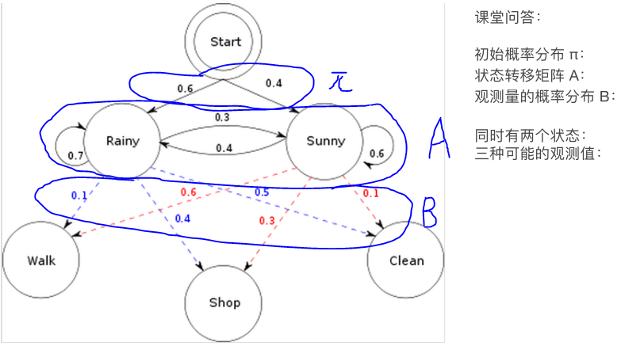

[toc]

# HMM(Hidden Markov Model)

## 1. 例子

不管今天阴晴，很多天之后的晴阴分布收敛到一个固定分布，叫做**稳态分布**。

我们就为上面的一阶马尔科夫过程定义了以下三个部分:

* 状态:晴天、阴天。

* 初始向量:定义系统在时间为0的时候的状态的概率。

* 状态转移矩阵:每种天气转换的概率。所有的能被这样描述的系统都是一个马尔科夫过程。

隐马尔科夫模型的**“隐”是指**隐藏的状态集合，如马尔可夫模型只能观察当天的股市处于什么状态，而隐马尔可夫模型可以观测的股市整体状况。

双层马尔科夫链，如（涨，跌）与（牛，熊）

## 2. 隐马尔科夫链三大问题：

* Evaluation（看到序列，判断出这个序列的概率）、
* Recognition（观测的是O，想知道的是Q，如语音识别，观测的是语音，想知道真是表达的内容)
* Training

其中model lambda = (A,B,pai)，A是指状态转移的矩阵，B是指观测量的概率分布，pai是指初始的概率分布。

举个例子如下，很清晰很具体很好地讲了上述概念

* 问题1，已知整个模型，我观测到连续三天做的事情是:散步，购物，收拾。那么，根据模型，计算产生这些行为的概率是多少。

  答：第一种方法：遍历算法，共2^3=8种可能，如其中一种为P(R,R,R,W,S,C)。

  第二种方法：向前算法，以t为时间序列的形式，先算第一天W的概率，再算第二天S的概率 ...复杂度是2*3=6

  第三种方法：向后算法

* 问题2，同样知晓这个模型，同样是这三件事，我想猜，这三天的天气是怎么样的。

  答：**Viterbi算法**，暴力图论，**动态规划**（用空间换时间）。

* 问题3， 最复杂的，我只知道这三天做了这三件事儿，而其他什么信息都没有。我得建立一个模型，晴雨转换概率，第一天天气情况的概率分布，根据天气情况选择做某事的概率分布。

  答：Baum-Welch算法。只能找到局部最优解，不能找到全局最优解。

## 3. 隐马尔科夫链应用：词性标注

在视频01:25:00

语言影响思维：中文中他与她都发ta，英文是her、his。

如符合语法的结构：adj.只能形容v.等。如下马尔可夫链。

注：如上图Det可以”喷射“出a、the等词，喷射（对应的单词是emission）概率分别是0.25、0.75。

如根据"I love you"反推出此grammer模型是什么，和上述问题3相同。然而问题3没什么意义，我们转换成类似问题2：先根据大量预料（corpus ）学习得出上面图片中的grammer模型，然后通过这个模型给"I love you"进行词性标注。 

图中公式分别对应前面所讲的模型中的A、B（在这里A表示词性转移矩阵，B表示观测值，即具体的某个单词），接下来类似LDA模型的推导，用频率去计算上述的A、B对应的式子。

注：MLE是极大似然估计

用代码实现上述案例，用到了NLTK包，它的一些有关词频的函数不清楚，也没听懂。然后又用代码实现了Viterbi算法，几乎也没听。

## Reference

[1] 七月在线