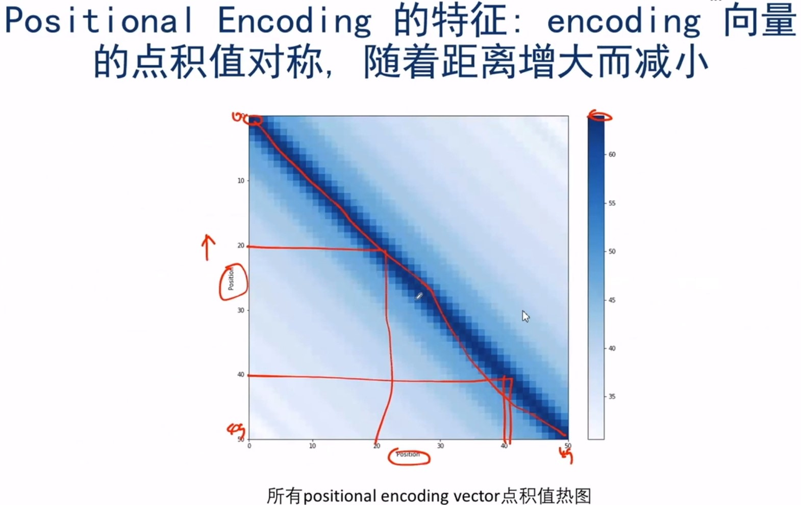

[TOC]

# Attention机制 -- Transformer

## QA

### 1.为什么使用transformer

## 0. 代码

[聊聊 Transformer](https://zhuanlan.zhihu.com/p/47812375)

[基于代码的运算顺序理解Transformer](https://mp.weixin.qq.com/s?__biz=MzIzNjc0MTMwMA==&mid=2247494325&idx=2&sn=87225a633dc19eb76801422e852f5a8c&chksm=e8d19d6edfa61478b6ac1419317e00d4a26136a3c1cc7254f61a7ad557ba7640449111af2853&mpshare=1&scene=23&srcid=&sharer_sharetime=1582549742541&sharer_shareid=f2db016cbffd15b40e734dd9b7a4efeb#rd)

 [The Annotated Transformer](<http://nlp.seas.harvard.edu/2018/04/03/attention.html>)

Bert-pytorch里面的实现

## 1. Scaled Dot-product Attention

上图表示的计算流程如下：

* 首先，Query向量与Key相乘进行点积操作（MatMul），即Attention机制中的score函数。

* `为防止结果过大`，然后对结果除以$\sqrt{d_k}$，其中$d_k$表示Query向量的某一维度，从而防止`梯度爆炸`。（Scale）

* 由于输入的句子长短不同，需要进行padding操作，以统一句子长度，此外为了避免补齐的数据会影响我们Attention的计算，因此需要**将补齐的数据设置为负无穷**，这样经过后面的softmax后接近于0，这样就不会对结果产生影响了。

* 然后通过SoftMax对上述结果进行归一化。(SoftMax)
* 最后对结果加权求和。（MatMul）

我们可以看到，这个依旧沿袭的是Attention的经典思想，不过在其中添加了一些操作Scale, Mask，这意味着对于Attention而言，其只有核心思想不变，适当的调整数据能够获得更好的结果，其公式如下：
$$
Attention(Q,K,V)=softmax(\frac{QK^T}{\sqrt{d_k}})V
$$
这里解释一下Scaled Dot-product Attention在本文中的应用，也称为self-attention的原因所在，这里的Q,K,V都是同源的

## 2. Multi-head Attention

这里的多头注意力指的是同时使用多个（h=8）注意力，对于每个注意力，使用的V，K，Q是相同的，V，K，Q分别经过Linear层，然后将结果输入到Scaled Dot-Product Attention层，最后将8个注意力结果进行Concat操作，并通过一个Linear层计算出最后一个结果。

其中，每个注意力的$W_v, W_k, W_q$是不同的，而且都参与训练。
$$
head_i=Attention(QW_i^Q,KW_i^K,VW_i^V)\\
MultiHead(Q,K,V)=Concat(head_1,...,head_n)W\,\,(n=8)
$$

## 3.残差网络，Normalization与feed-forward network

* 首先，Encoder和Decoder有着大量的残差网络，残差网络可以弥补深层网络的信息损失。
* 其次，有一个Layer Normalization过程。

* 然后，数据经过一个前馈神经网络，该前馈神经网络采用了两个线性变换，`激活函数为Relu，如下`：

$$
FFN(x)=Relu(xW_1+b_1)W_2+b_2
$$

## 4. Transformer中使用Multi-head Attention的细节

Transformer中使用多头注意力机制需要注意一下几点：

* 在Encoder和Decoder中的黑色框中，采用的Self-attention，即Q,K,V是同源的。
* `只有在Decoder中的Multi-head中才使用Sequencing Mask操作，而在Encoder中不使用Sequencing Mask操作，这是因为在预测第t时刻的词时，只能知道它之前时刻的信息，不能知道它以后的信息，因此需要将t时刻以及之后的词遮住，只对前面的词进行self-attention`，这点不理解的话可以回想一下Sequence-to-Sequence那篇文章中对机器翻译的训练过程
* 在黄色框中，Q来自Decoder层，K, V来自Encoder的输出

如图，在self-attention中，K Q V向量都是通过输出的词向量X产生的，即
$$
K=X*W_K,Q=X*W_Q,V=X*W_V
$$
这里为了使decoder获取encoder的信息，Q向量的产生用Decoder上层的输出X进行计算：$Q=X*W_Q$，但K V向量由Encoder的输出向量M（即attention vector）产生：$K=M*W_K,V=M*W_V$。

## 5. Positional encoding  [浅谈 Transformer-based 模型中的位置表示](https://zhuanlan.zhihu.com/p/92017824)

由于self-attention捕捉不到句子中单词的位置信息，因此Transformer添加Positional encoding进行弥补。`论文中采用了正余弦函数的方式，本质核心思想是：通过借助位置的编码公式（在偶数位置，使用正弦编码，在奇数位置，使用余弦编码），让模型学习到相对位置的信息`
$$
PE(pos, 2i)=sin(pos/10000^{{2i}/{d_{model}}})\\
PE(pos, 2i)=cos(pos/10000^{{2i}/{d_{model}}})
$$
其中，pos指的是token的位置。设句子的长度为L，那么pos=0,1...L-1，i是向量的某一维度，例如$d_{model}$=512时，i=0,1,..255。

通过上式，我们可以得出：
$$
PE(pos+k,2i)=PE(pos,2i)*PE(k,2i+1)+PE(pos,2i+1)*PE(k,2i)\\
PE(pos+k,2i+1)=PE(pos,2i+1)*PE(k,2i+1)-PE(pos,2i)*PE(k,2i)
$$
如此获得的position embedding，两者之间的点积能够反映相对距离。

计算实例：

不同位置的词得到的position embedding不一样，从而区分出不同词的位置。同时`position embedding好像是可以随着训练调整的`

我们可以用过两个向量的点积来判断它们之间的关系，如上图，距离越近的两个词对应的词向量点积值越大。

参考[Self-Attention与Transformer](https://www.bilibili.com/video/av89296151?p=2)：第60分钟视频讲解

## 6.最后的Linear和softmax

在最后一层加一个前馈神经网络来增加模型的泛化能力，最后用一个softmax来进行预测，如下图，即对logits（元素取值可能为负的，也可能超过1）进行归一化，得到log_probs（元素取值为0-1，且元素之和为1）.

## 7. 训练小技巧

如下图：

* label smothing是为了防止over fitting

  具体例子，如

  

  对于位置1，target为[0 0 1 0 0 0]，比如我们觉得“I”对应位置取0.9就可以了，那么其它位置就取(1-0.9)/5=0.02，所以经过平滑以后变为[0.02 0.02 0.9 0.02 0.02]

* norm learning rate schedule

  如图，前5000步为预热阶段，学习率从0开始线性增长，达到最大值0.0014后，开始指数衰减。

## 回归到整体

* Encoder是由一个Stack组成，Stack中有6个相同的Layer，每个Layer的结构如图3所示。
* Decoder同样由一个Stack组成，Stack中有6个相同的Layer，但是与Encoder中的Layer不同，主要是多了一个将Encoder输出引入的Multi-Head机制，如图3所示。
* 使用的是交叉熵损失函数。

## Reference

[The Illustrated Transformer](<https://jalammar.github.io/illustrated-transformer/>)

## QA

## 1. Mask三连问

### mask操作是什么？

mask是对某些值进行掩盖，使得其在参数更新时不产生效果

### 它是怎么做？

把需要被遮住的部分设置为负无穷，然后经过softmax以后这些位置对应的概率就会变成接近于0，这样就不会对结果产生影响。

### 为什么要mask？

Transformer中的mask分为两种：

* Padding mask:考虑到每个批次中输入序列的长度是不一样的，而往往我们要先进行对其，对不足长度的文本进行 padding， 而这些padding 的词其实是没有意义的， 因此我们在做 Self-attention 的时候应该忽略它。

* `Sequence mask`:在Decoder中，其不应该看到未来的信息，即对一个序列，当位于第t个时间步时，Decoder的输出应该之和t时刻之前的输入有关，而不应该依赖于t时刻之后的输入。

`具体做法是，产生一个上三角矩阵，上三角的值全为1，下三角的值全为0，对角线也是0。`

## `2. Scaled Dot-Product Attention中的Scaled是啥，有啥用？`

Scaled`就是缩放数据`

* `比较大的输入会使得sfotmax的梯度变得很小，当数量级较大时，softmax将几乎全部的概率分布都分配给了最大值对应的标签，此时梯度消失为0，参数更新会变得困难`
* `假设Q，K的各个分量是相互独立的随机变量，均值为0，方差为1，那么点积QK的均值为0，方差为`$d_k$。`方差越大，说明点积的数量级越大，通过除以`$\sqrt{d_k}$将方差稳定到1，可以有效的控制前面提到的梯度消失问题。

## 3. 为什么Position embedding 采用正余弦函数？

因为有：
$$
PE(pos+k)=PE(pos)+PE(k)
$$
这样使得模型可以记住相对位置信息。但是还是没有用，见 [浅谈 Transformer-based 模型中的位置表示](https://zhuanlan.zhihu.com/p/92017824)

## 4. 为什么在激活函数前加Layer normalization？

Normalization 有很多种，但是它们都有一个共同的目的，那就是把输入转化成均值为 0 方差为 1 的数据。我们在把数据送入激活函数之前进行 normalization（归一化），因为我们**不希望输入数据落在激活函数的饱和区**。常见的有BN与LN，这里采用的是LN,，如下所示：

u是样本均值，$\sigma$是样本方差，当g=1,b=0时，样本数据的均值就变为0，方差变为1，然后这种情况可能不是最好的，比如b=0.5更加合适等，于是就多设两个参数g和b让网络自动去学习该参数值。

同时Batch Normalization的效果与batch的大小具有强相关，而LN只关注每条样本自己。

## 5. RNN到Attention

RNN存在梯度消失或者梯度爆炸的问题，LSTM或者GRU只是一定程度上缓解了这个问题。

## 6. Decoder细节

* Decoder中除了使用Multi-head attention外，还是用了Encoder-Decoder Attention

* Decoder向Encoder传输了Attention Vector(即K,V向量)

  

同时需要注意Previous Outputs是指第t-1时刻Decoder的输出，即已经预测到的单词，作为下一时刻t的输入，与经典的SeqtoSeq模型一样，只是SeqtoSeq的特征抽取器一般使用的是RNN。

## 7. 为什么使用残差网络？

因为通过梯度下降求得误差向后传播，随着网络加深损失传播越来越弱。通过连接残差网络（跳跃某些层进行连接），可以使得有多条路径到达相对底层的网络，缓解损失传播越来越弱的问题。

## 8. Transformer的优点与缺点

